# PM2 / PM2 Lightweight / Para 3 / Para 3 Lightweight — Regular Production, Sprint Runs & Exclusives (2010 – Jul 2026)

Model numbers checked against spyderco.com product listings where the model is still listed. Sources: Spydiewiki "C81 Para-Military" and "C223 Para 3" variation tables; forum thread t=90980 (2019+). "Alt SKU" = number used in the forum thread where it differs.

## ParaMilitary 2 (95)

| # | Image | Model No. | Released | Steel | Handle | Type | Qty | Alt SKU |
|---|---|---|---|---|---|---|---|---|
| 1 | <a href="images/C81GP2.jpg">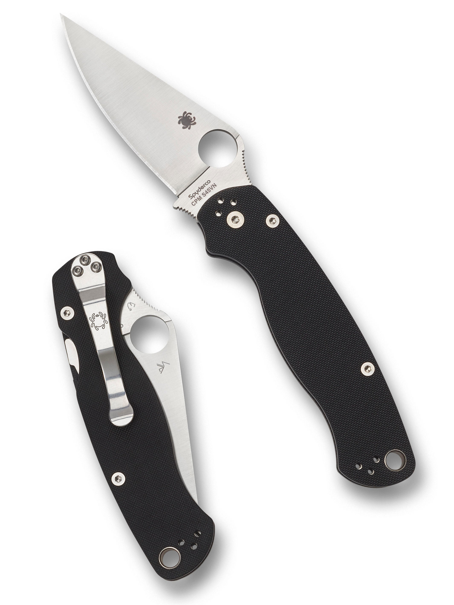</a> | C81GP2 | 2010- | CPM-S30V | Black G-10 | Regular production |  |  |
| 2 |  | C81CFP2 | 2010 | CPM-S90V | Black Peel Ply CF | Sprint Run | 600 |  |
| 3 | <a href="images/C81GPBK2.jpg">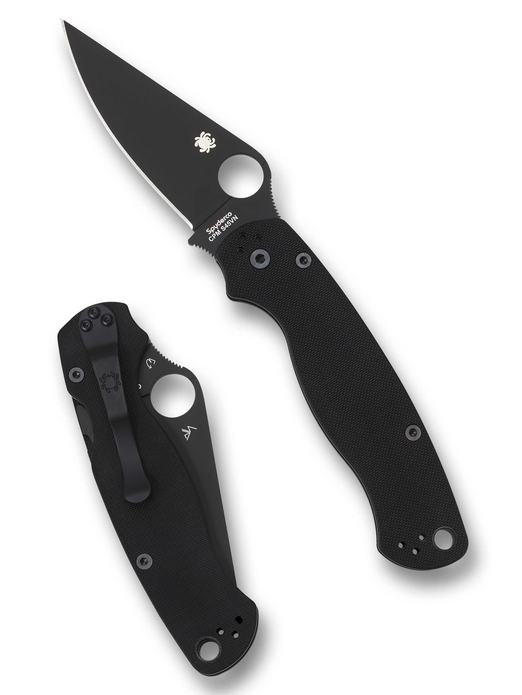</a> | C81GPBK2 | 2011- | CPM-S30V black DLC | Black G-10 | Regular production |  | C81GBK2 (wiki) |
| 4 | <a href="images/C81GPCMO2.jpg">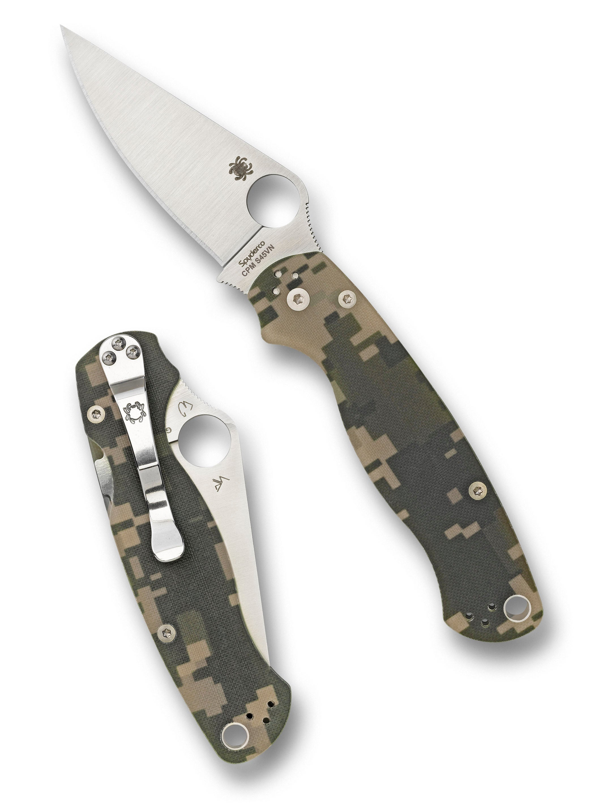</a> | C81GPCMO2 | 2011- | CPM-S30V | Digital Camo G-10 | Regular production |  | C81GCMO2 (wiki) |
| 5 | <a href="images/C81GPCMOBK2.jpg">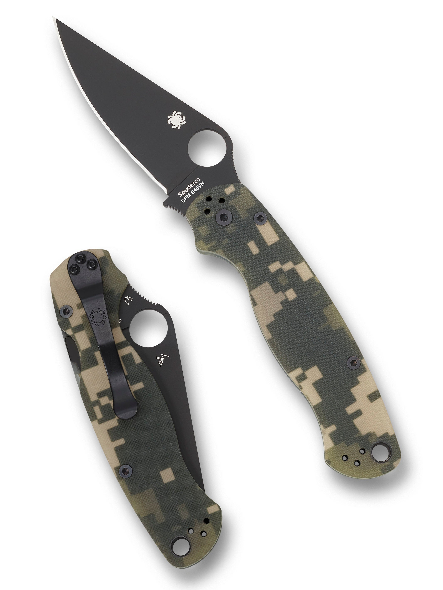</a> | C81GPCMOBK2 | 2011- | CPM-S30V black DLC | Digital Camo G-10 | Regular production |  | C81GCMOBK2 (wiki) |
| 6 |  | C81GGY20CP2 | 2011 | CTS-20CP | Gray G-10 | Sprint Run | ? |  |
| 7 |  | C81GBLM3902 | Jan. 2012 | M390 | Blue G-10 | Bento Box Shop excl. | 800 (1st run) |  |
| 8 |  | C81GPBN2 | Mar. 2012 | CPM-S35VN | Earth Brown G-10 | Moteng excl. |  |  |
| 9 |  | C81GPOR2 | 2012 Apr. | CTS-XHP | Orange G-10 | Cutlery Shoppe excl. | 800 |  |
| 10 |  | C81GPGR2 | June 2013 | CTS-204P | Dark Green G-10 | Blue Ridge Knives excl. | 1200 |  |
| 11 |  | C81CFPE2 | Feb. 2014 | CPM-154/S90V | Peel Ply CF | Sprint Run | 300 |  |
| 12 |  | C81GFGP2 | June 2014 | Elmax | Foliage Green G-10 | Bento Box Shop excl. | 800-1200 |  |
| 13 |  | C81GPDBL2 | Sept. 2015- | CPM-S110V | Dark blue G-10 | Regular production |  |  |
| 14 |  | C81GPORBK2 | Oct. 2015-Feb. 2016 | Black DLC coated CTS-XHP | Orange G-10 | Exclusive | 1200 |  |
| 15 |  | C81GM4P2 | July 2016 | CPM-M4 | Jade G-10 | BladeHQ excl. | 2300 (2200 + 100 CC) |  |
| 16 |  | C81CFM4P2 | Aug. 2016/Mar. 2018 | CPM-M4 | Peel Ply CF | Knifeworks excl. | 1200 + 800 |  |
| 17 |  | C81GPGY2 | Oct. 2016 | Cru-Wear | Dark grey G-10 | Sprint Run | 1200 |  |
| 18 | <a href="images/C81GPNP2.jpg">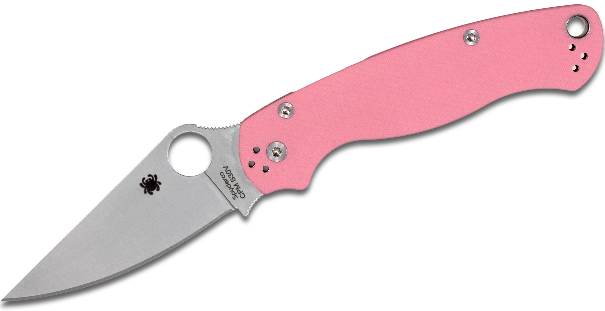</a> | C81GPNP2 | Dec. 2016 | CPM-S30V | Light pink G-10 | Exclusive | 1200 |  |
| 19 |  | C81GS2 | Mar. 2017- | CPM-S30V | Black G-10 | Regular production |  |  |
| 20 |  | C81GPLE2 | Apr. 2017 - | CPM-S30V | Black G-10 | Regular production |  |  |
| 21 |  | C81GPBKBS2 | June. 2017 | Black DLC coated CPM-S30V | Black G-10 | Exclusive |  |  |
| 22 |  | C81CF52100P2 | Oct. 2017 | 52100 | Peel Ply CF | H.L. Dalis excl. |  |  |
| 23 |  | C81GPRD2 | Nov. 2017 | M390 | Red G-10 | DLT Trading excl. | 1000-1200 |  |
| 24 |  | C81GPDGY2 | Nov. 2017- | Maxamet | Dark gray G-10 | Regular production |  |  |
| 25 |  | C81CF52100PS2 | Dec. 2017 | 52100 | Peel Ply CF | H.L. Dalis excl. |  |  |
| 26 |  | C81GPGRBKP2 | Feb. 2018 | Black DLC coated CPM-S30V | Olive drab green G-10 | JB Outman excl. |  |  |
| 27 |  | C81GM4BKP2 | Mar. 27, 2018, 7PM MST | Black DLC coated CPM-M4 | Jade G-10 | BladeHQ excl. | Limited (probably 2200-2400) |  |
| 28 |  | C81GPCW2 | May 2018 | Cru-Wear | Smooth black G-10 | KnifeCenter excl. |  |  |
| 29 |  | C81GPBORE2 | July 2018 | CPM REX 45 | Burnt orange G-10 | Sprint Run |  |  |
| 30 |  | C81GPTN2 | Sept. 25, 2018, 11AM CST | CPM-20CV | Tan G-10 | DLT Trading excl. | 900-1000 (1st batch) |  |
| 31 |  | C81GPDGYS90V2 | Oct. 12, 2018 9AM MDT | CPM-S90V | Gray G-10 | Limited | Just over 700 |  |
| 32 |  | C81GPBNBK2 | Mar. 2019 | Black DLC coated CPM-S35VN | Earth Brown G-10 | Moteng excl. |  |  |
| 33 |  | C81GPTNBK2 | May 29, 2019, 11AM CST | Black DLC coated CPM-20CV | Tan G-10 | DLT Trading excl. | 800 |  |
| 34 |  | C81GPBLBK2 | August 2019 | Black DLC coated M390 | Blue G-10 | Bento Box Shop excl. |  |  |
| 35 | <a href="images/C81GPRGR2.jpg">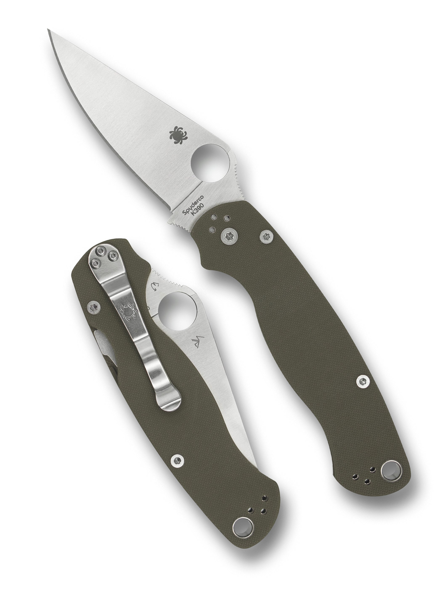</a> | C81GPRGR2 | Oct. 04, 2019 @ 9AM PST | Satin K390 | Ranger Green G-10 | Bento Box Shop excl. |  |  |
| 36 |  | C81GPNGR2 | Dec. 12, 2019 @ 11AM CST | Satin CPM-20CV | Neon Green G-10 | KnifeJoy excl. | 502 |  |
| 37 |  | C81GPCB2 | Mar. 18, 2020 @ ~7AM PST (preorder) | Satin CPM-10V | Coyote Brown G-10 | River's Edge Cutlery excl. | ~700 |  |
| 38 |  | C81GPCBBK2 | Mar. 18, 2020 @ ~7AM PST (preorder) | Black DLC coated CPM-10V | Coyote Brown G-10 | River's Edge Cutlery excl. | ~700 |  |
| 39 |  | C81GPFGR2 | April 2020 | Satin CPM S45VN | Forest Green "diamond arc pattern" G-10 | Sprint Run |  |  |
| 40 |  | C81GPRDBK2 | April 25, 2020 @ 3PM CST | Black DLC coated CPM-4V | Red G-10 | St. Nick's Knives excl. | 1200 |  |
| 41 |  | C81GPW2 | May 2020 | Satin CPM-S30V | Black G-10 | Blade Ops excl. |  |  |
| 42 |  | C81GPWBK2 | June 2020 | Black DLC coated CPM-S30V | Black G-10 | Blade Ops excl. |  |  |
| 43 |  | C81CUP2 | June 2020 | Satin CPM REX 45 | Natural Copper | BladeHQ excl. |  |  |
| 44 |  | C81GPTBK2 | July 2020 | Black DLC coated CPM-S30V, Tanto | Black G-10 | BladeHQ excl. |  |  |
| 45 |  | C81GPPRBK2 | Aug. 2020 | Black DLC Cru-Wear | Purple G-10 | DLT Trading excl. |  |  |
| 46 |  | C81GPODFDE2 | Aug. 2020 | Flat dark earth PVD coated CTS-204P | Olive drab G-10 | River's Edge Cutlery excl. |  |  |
| 47 |  | C81GPT2 | Dec. 2020 | Satin CPM-S30V | Black G-10 | Blade HQ excl. |  |  |
| 48 |  | C81MPCW2 | 2021 | Satin Cru-Wear | Brown canvas Micarta | Regular production |  | C81MCW2 (wiki) |
| 49 |  | C81GM4PT2 | Jan. 2021 | Satin CPM-M4 | Natural G-10 | Blade HQ excl. |  |  |
| 50 |  | C81GM4PTBK2 | Jan. 2021 | Black DLC coated CPM-M4 | Natural G-10 | Blade HQ excl. |  |  |
| 51 |  | C81GWC2 | Feb. 2021 | CPM-S30V | Black G-10 | Cutlery Shoppe excl. |  | C81GPWC2 |
| 52 |  | C81GPODBK2 | March 2021 | Black DLC coated CPM-S90V | Olive Drab Green G-10 | DLT Trading excl. |  |  |
| 53 |  | C81GCOFL2 | June 2021 | Laser engraved CPM SPY27 | multi-colored G-10 | Sprint Run |  | C81GPCOFL2 |
| 54 |  | C81GPNGRBK2 | July 2021 | Black DLC coated CPM-20CV | Neon Green G-10 | Knife Joy excl. |  |  |
| 55 |  | C81CFPBLBK2 | August 2021 | Black DLC coated CPM-M4 | Blue Carbon Fiber | Smoky Mountain Knife Works excl. |  |  |
| 56 |  | C81CUPBK2 | August 2021 | Black DLC coated CPM REX 45 | Natural Copper | Blade HQ excl. |  |  |
| 57 |  | C81GPDGYLMX2 | September 2021 | Elmax | Dark Gray G-10 | BladeOps excl. |  |  |
| 58 |  | C81CFPBL2 | October 2021 | CPM-M4 | Blue Carbon Fiber | Smoky Mountain Knife Works excl. |  |  |
| 59 |  | C81CFPGRBK2 | November 2021 | Black DLC coated CPM-M4 | Green Carbon Fiber | Smoky Mountain Knife Works excl. |  | C81CFPGR2 |
| 60 |  | C81CFPRDORBK2 | December 2021 | Black DLC coated CPM-M4 | Red Carbon Fiber | Smoky Mountain Knife Works excl. |  | C81CFPRDOR |
| 61 |  | C81ALPPR2 | 21 December 2021 | CTS-BD1N | Purple anodized Aluminum | Blade HQ excl. |  |  |
| 62 |  | C81ALPBL2 | 21 December 2021 | CTS-BD1N | Blue anodized Aluminum | Blade HQ excl. |  |  |
| 63 |  | C81ALPGR2 | 21 December 2021 | CTS-BD1N | Green anodized Aluminum | Blade HQ excl. |  |  |
| 64 |  | C81GPORBL2 | January 2022 | CPM REX 45 | Orange & Blue G-10 | Cutlery Shoppe excl. | ~700 |  |
| 65 |  | C81MCFLMXP2 | January 2022 | Elmax | Marbled Carbon fiber | Fradon Lock excl. | ~800 |  |
| 66 |  | C81GPOROD2 | January 2022 | CPM REX 45 | Green & Orange G-10 | Cutlery Shoppe excl. | ~700 |  |
| 67 |  | C81ALPBK2 | 16 March 2022 | CTS-BD1N | Black anodized Aluminum | Blade HQ excl. |  |  |
| 68 |  | C81ALPOR2 | 16 March 2022 | CTS-BD1N | Orange anodized Aluminum | Blade HQ excl. |  |  |
| 69 |  | C81ALPRD2 | 16 March 2022 | CTS-BD1N | Red anodized Aluminum | Blade HQ excl. |  |  |
| 70 |  | C81GPWCBK2 | 1 April 2022 | Black DLC coated CPM-S30V | Black G-10 | Cutlery Shoppe excl. |  |  |
| 71 |  | C81GPPR2 | April 2022 | Cru-Wear | Purple G-10 | DLT Trading excl. |  | C81GPR2 |
| 72 |  | C81GPWCOR2 | August 2022 | CTS-XHP | Orange G-10 | Cutlery Shoppe excl. |  |  |
| 73 |  | C81GPTLBK2 | August 2022 | Black DLC coated CPM-S90V | Teal G-10 | MGE Wholesale excl. |  |  |
| 74 |  | C81GPWCORBK2 | September 2022 | Black DLC coated CTS-XHP | Orange G-10 | Cutlery Shoppe excl. |  |  |
| 75 |  | C81FCGR2 | October 2022 | CPM-M4 | Green Carbon Fiber | Smoky Mountain Knife Works excl. |  |  |
| 76 |  | C81GPCWBK2 | Dec. 2022 | Black DLC coated Cru-Wear | Smooth Black G-10 | Knifecenter excl. |  |  |
| 77 |  | C81GPCBL2 | 2023 - | CPM SPY27 | Cobalt blue G-10 | Regular production |  | C81GCBL2 (wiki) |
| 78 |  | C81GMCBKP2 | 2023 - | Black DLC-coated CPM MagnaCut | Black G-10 | Regular production |  | C81GBKYLMC2 (wiki) |
| 79 |  | C81GBN15V2 | Feb. 2023 | CPM 15V | Brown G-10 | Sprint Run |  | C81GPBN15V2 |
| 80 |  | C81CFRDOR2 | Mar. 2023 | CPM-M4 | Red Carbon Fiber | Smoky Mountain Knife Works excl. |  |  |
| 81 |  | C81GPTL2 | June 2023 | CPM-S90V | Teal G-10 | MGE Wholesale excl. |  |  |
| 82 |  | C81GPGYW2 | Oct. 2023 | Elmax | Dark Gray G-10 | BladeOps excl. |  |  |
| 83 |  | C81GDGYRX76BKP2 | Nov. 2024 | Black DLC-coated CPM REX 76 | Brick dark grey G-10 | GP Knives excl. |  |  |
| 84 |  | C81GBKYLMCP2 | Dec. 2024 - | CPM MagnaCut | Yellow and black G-10 | Regular production |  | C81GBKYLMC2 (wiki) |
| 85 |  | C81GDGYRX76P2 | Feb. 2025 | Satin CPM REX 76 | Brick dark grey G-10 | GP Knives excl. |  |  |
| 86 |  | C81GBKRDMCBKP2 | Apr. 2025 | Black DLC-coated CPM MagnaCut | Red and Black G-10 | Limited |  |  |
| 87 |  | C81CFSPY27P2 | Oct. 2025 | CPM SPY27 | Black Dunes pattern Fatcarbon Carbon Fiber | H.L. Dalis Inc. excl. |  |  |
| 88 |  | C81GPORRX1212 | Jan. 5 2026 | CPM REX 121 | HEX Pattern Orange G-10 | Exclusive |  |  |
| 89 |  | C81GPWCORRX1212 | Jan. 5 2026 | CPM REX 121 | HEX Pattern Orange G-10 | Exclusive |  |  |
| 90 |  | C81GNDMCP2 | March 2026 | CPM MagnaCut | Natural diamond mesh G-10 | Blade HQ excl. |  |  |
| 91 |  | C81GNDMCPBK2 | March 2026 | Black DLC-coated CPM MagnaCut | Natural diamond mesh G-10 | Blade HQ excl. |  |  |
| 92 |  | C81GPWCORRX121BK2 | April 2026 | Black VaporTech ZrOC-coated CPM REX 121 | HEX Pattern Orange G-10 | Cutlery Shoppe excl. |  |  |
| 93 | <a href="images/C81GPORRX121BK2.jpg">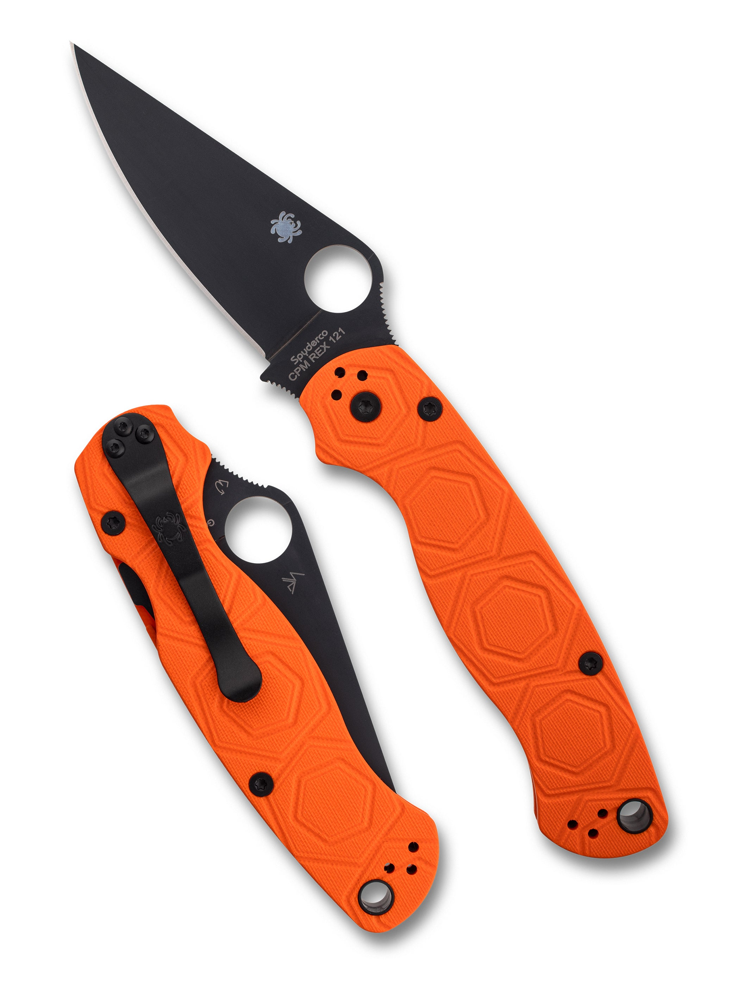</a> | C81GPORRX121BK2 | May 2026 | Black VaporTech ZrOC-coated CPM REX 121 | HEX Pattern Orange G-10 | Exclusive |  |  |
| 94 |  | C81GBKM4TP2 | July 2026 | CPM-M4, Tanto | Black G-10 | BladeHQ excl. |  |  |
| 95 |  | C81GBKBKM4TP2 | July 2026 | Black DLC coated CPM-M4, Tanto | Black G-10 | BladeHQ excl. |  |  |

## ParaMilitary 2 Lightweight (4)

| # | Image | Model No. | Released | Steel | Handle | Type | Qty | Alt SKU |
|---|---|---|---|---|---|---|---|---|
| 1 |  | C81PBK2 | Jan. 2026 - | CTS-BD1N | Black FRN | Regular production |  | C81BK2 (wiki) |
| 2 |  | C81SBK2 | Jan. 2026 - | CTS-BD1N (SpyderEdge) | Black FRN | Regular production |  |  |
| 3 |  | C81PBBK2 | March 2026 - | Black DLC-coated CTS-BD1N | Black FRN | Regular production |  | C81BK2 (wiki) |
| 4 |  | C81PBN15V2 | April 2026 | CPM 15V | Brown FRN | Sprint Run |  |  |

## Para 3 (47)

| # | Image | Model No. | Released | Steel | Handle | Type | Qty | Alt SKU |
|---|---|---|---|---|---|---|---|---|
| 1 | <a href="images/C223GP.jpg">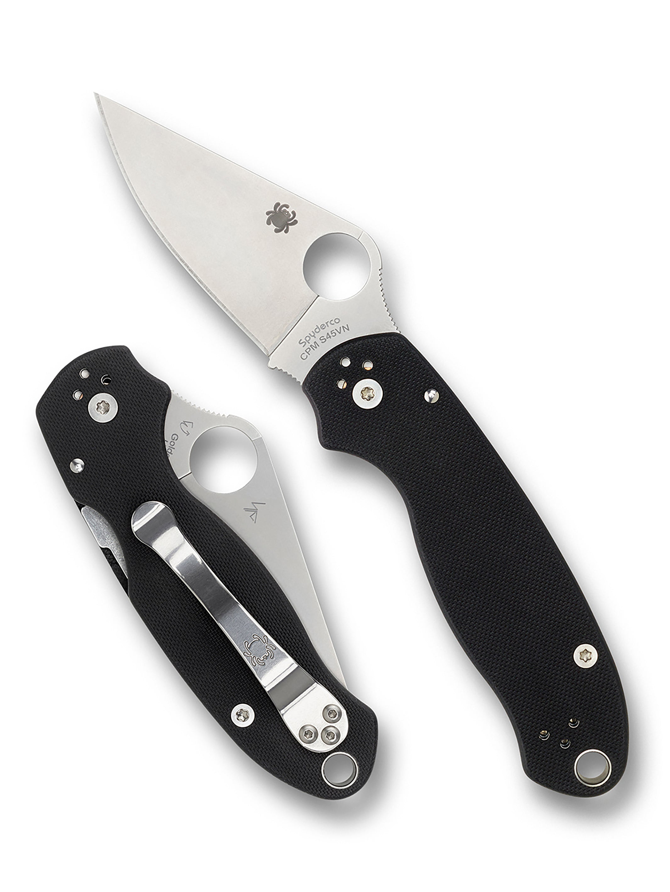</a> | C223GP | Dec. 2016- | CPM-S30V | Black textured G-10 | Regular production |  |  |
| 2 | <a href="images/C223GPS.jpg">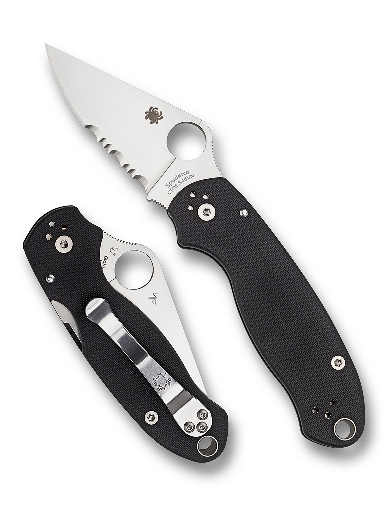</a> | C223GPS | Mar. 2017- | CPM-S30V | Black textured G-10 | Regular production |  |  |
| 3 |  | C223GPCMO | May 2017- | CPM-S30V | Digi camo G-10 | Regular production |  |  |
| 4 |  | C223GS | June 2017- | CPM-S30V | Black textured G-10 | Regular production |  |  |
| 5 | <a href="images/C223GPBK.jpg">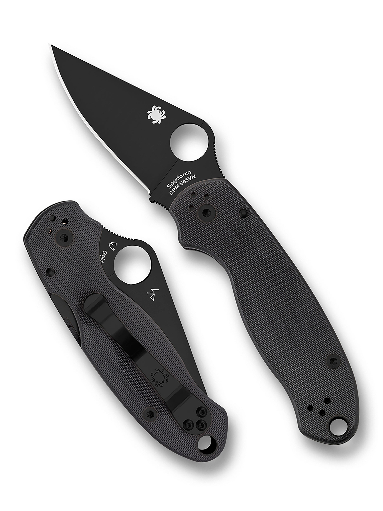</a> | C223GPBK | June 2017- | Black CPM-S30V | Black textured G-10 | Regular production |  |  |
| 6 |  | C223GPDBL | Aug. 2017- | CPM-S110V | Dark blue G-10 | Regular production |  |  |
| 7 |  | C223GPCMOBK | Aug. 2017- | Black CPM-S30V | Digi camo G-10 | Regular production |  |  |
| 8 |  | C223GPGYCW | Aug. 2017 | Cru-Wear | Gray G-10 | Sprint Run |  |  |
| 9 |  | C223CF90VP | Feb. 2018 | CPM-S90V | Black peel ply CF | Sprint Run |  |  |
| 10 | <a href="images/C223GPBL.jpg">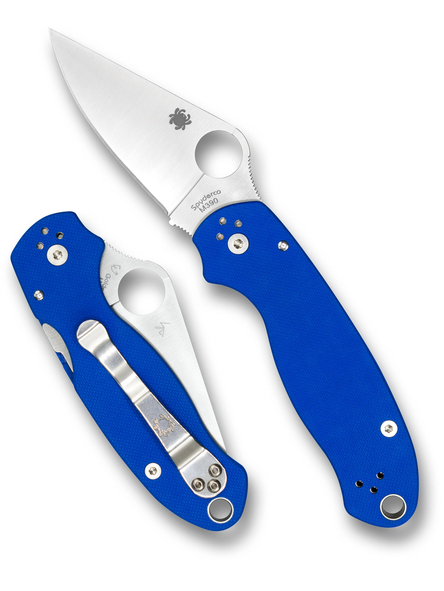</a> | C223GPBL | Feb. 2018 | M390 | Blue G-10 | Bento Box Shop excl. | Limited (2 batches) |  |
| 11 |  | C223GPDGY | Mar. 2018- | Maxamet | Dark gray G-10 | Regular production |  |  |
| 12 |  | C223GM4P | June 26, 2018 | CPM-M4 | Jade G-10 | Blade HQ excl. |  |  |
| 13 |  | C223GPODFDE | July 2018 | Flat dark earth PVD coated CTS-204P | Olive drab G-10 | River's Edge Cutlery excl. | 600 |  |
| 14 |  | C223GM4PBK | July 2018 | Black DLC CPM-M4 | Jade G-10 | Blade HQ excl. |  |  |
| 15 |  | C223GPBORE | Aug. 2018 | CPM REX 45 | Burnt orange G-10 | Sprint Run |  |  |
| 16 |  | C223CF52100P | Aug. 2018 | 52100 | Black CF | H.L. Dalis excl. |  |  |
| 17 |  | C223GPBN | Sept. 2018 | CPM-S35VN | Earth brown G-10 | Moteng excl. | 1200 |  |
| 18 |  | C223GPRDBK | Sept. 20, 2018 | Black DLC CPM-4V | Red G-10 | St. Nick's Knives excl. | ~700 |  |
| 19 |  | C223CF52100PS | Oct. 2018 | 52100 | Black CF | H.L. Dalis excl. |  |  |
| 20 |  | C223GPCW | Oct. 2018 | Cru-Wear | Smooth black G-10 | Knife Center excl. | 600 |  |
| 21 |  | C223GPOR | Nov. 16, 2018 @ 10AM MST | Satin CTS-XHP | Orange G-10 | Cutlery Shoppe excl. |  |  |
| 22 |  | C223GPORBK | Nov. 16, 2018 @ 10AM MST | Black DLC CTS-XHP | Orange G-10 | Cutlery Shoppe excl. |  |  |
| 23 |  | C223GPBNBK | Apr. 2019 | Black DLC coated CPM-S35VN | Earth Brown G-10 | Moteng excl. |  |  |
| 24 |  | C223GPRD | Aug. 2019 | M390 | Red G-10 | Exclusive |  |  |
| 25 | <a href="images/C223GPRGR.jpg">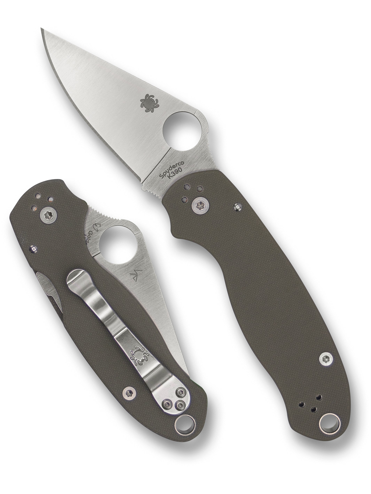</a> | C223GPRGR | Nov. 1, 2019 @ 1pm PST | K390 | Ranger Green G-10 | Bento Box Shop excl. |  |  |
| 26 |  | C223GPOROD | Mar. 15, 2020 @ 12pm MDT | Satin CPM REX 45 | Orange and olive drab green G-10 | Cutlery Shoppe excl. | 600 |  |
| 27 |  | C223GPORBL | Mar. 29, 2020 | Satin CPM REX 45 | Orange and blue G-10 | Cutlery Shoppe excl. | 600 |  |
| 28 |  | C223GPGR | Apr. 2020 | CTS-204P | Forest Green G-10 | KnifeWorks excl. |  |  |
| 29 |  | C223GPFGR | Jul. 2020 | CPM S45VN | Forest Green "diamond arc pattern" G-10 | Sprint Run |  |  |
| 30 |  | C223GPPRBK | Nov. 2020 | Black DLC coated Cru-Wear | Purple G-10 | DLT Trading excl. |  | C223GPRBK (wiki) |
| 31 |  | C223GPPN | 2021 | CPM S45VN | Pink G-10 | KnifeJoy excl. |  |  |
| 32 |  | C223GPNGRBK | April 2021 | Black DLC coated CPM-20CV | Neon green G-10 | KnifeJoy excl. |  | C223GNGRBK (wiki) |
| 33 |  | C223GPCWBK | Aug. 2021 | Black DLC coated Cru-Wear | Smooth black G-10 | Knifecenter excl. |  |  |
| 34 |  | C223MCFLMXP | August 2022 | Elmax | Marbled Carbon fiber | Fradon Lock Company excl. | ~600 |  |
| 35 |  | C223GPNGR | Oct. 2022 | CPM-20CV | Neon green G-10 | KnifeJoy excl. |  | C223GNGR |
| 36 |  | C223GPTNBK | November 1, 2022 @ 9AM PST | Black DLC coated CPM-20CV | Tan G-10 | DLT Trading excl. |  |  |
| 37 |  | C223GPCBL | 2023 - | CPM SPY27 | Cobalt blue G-10 | Regular production |  | C223GCBL (wiki) |
| 38 |  | C223MPCW | 2023 - | Cru-Wear | Brown canvas Micarta | Regular production |  | C223MCW (wiki) |
| 39 |  | C223GPCBBK | June 2023 | Black DLC-coated CPM-10V | Coyote Brown G-10 | River's Edge Cutlery excl. |  |  |
| 40 |  | C223GPCB | July 2023 | CPM-10V | Coyote Brown G-10 | River's Edge Cutlery excl. |  |  |
| 41 | <a href="images/C223GMCBKP.jpg">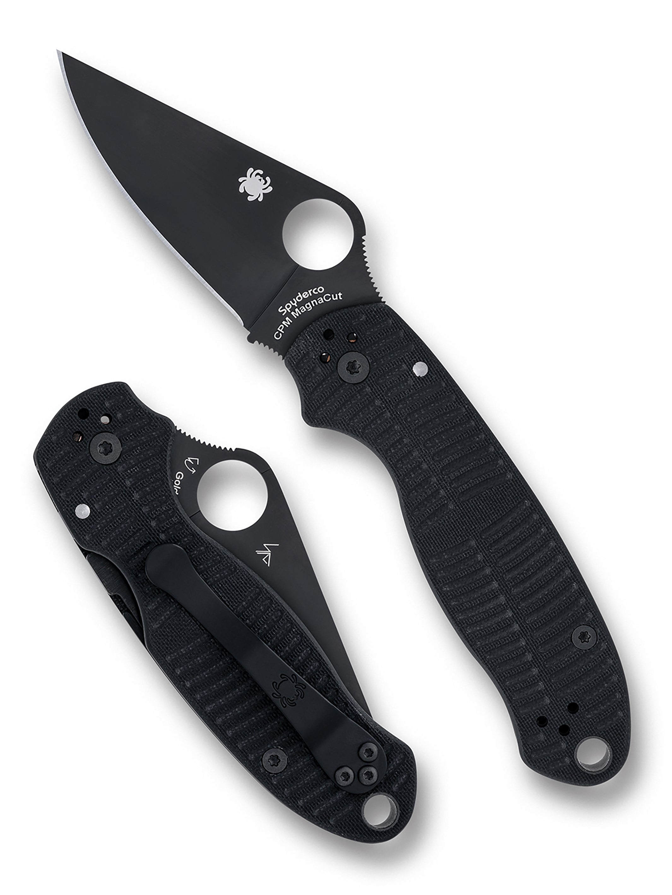</a> | C223GMCBKP | 2024 - | CPM MagnaCut | Black G-10 | Regular production |  | C223GMCBK (wiki) |
| 42 |  | C223GPBN15V | 2024 - | CPM 15V | Brown G-10 | Sprint Run |  | C223GBN15V (wiki) |
| 43 | <a href="images/C223GBKYLMCP.jpg">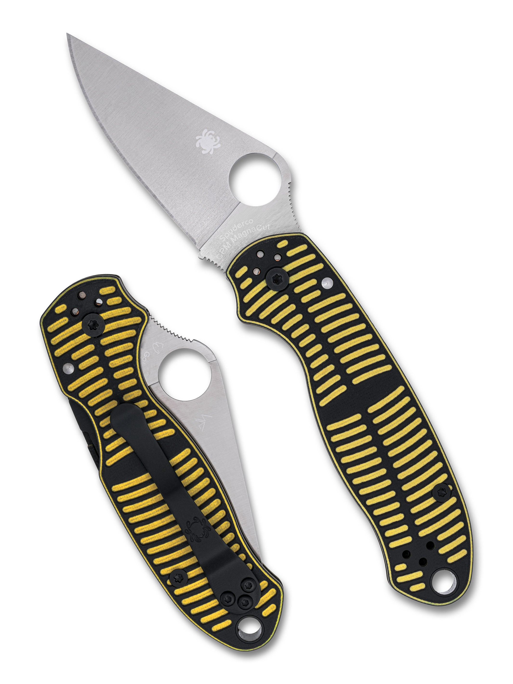</a> | C223GBKYLMCP | Nov. 2025 - | CPM MagnaCut | Black & Yellow G-10 | Regular production |  | C223GBKYLMC (wiki) |
| 44 |  | C223CFTSBKP | Nov. 2025 | Cru-Wear | Toxic storm pattern Fatcarbon Carbon Fiber | Smoky Mountain Knife Works excl. |  |  |
| 45 |  | C223CFPHBKP | Dec. 2025 | Black DLC-coated Cru-Wear | Purple haze pattern Fatcarbon Carbon Fiber | Smoky Mountain Knife Works excl. |  |  |
| 46 | <a href="images/C223GNDMCP.jpg">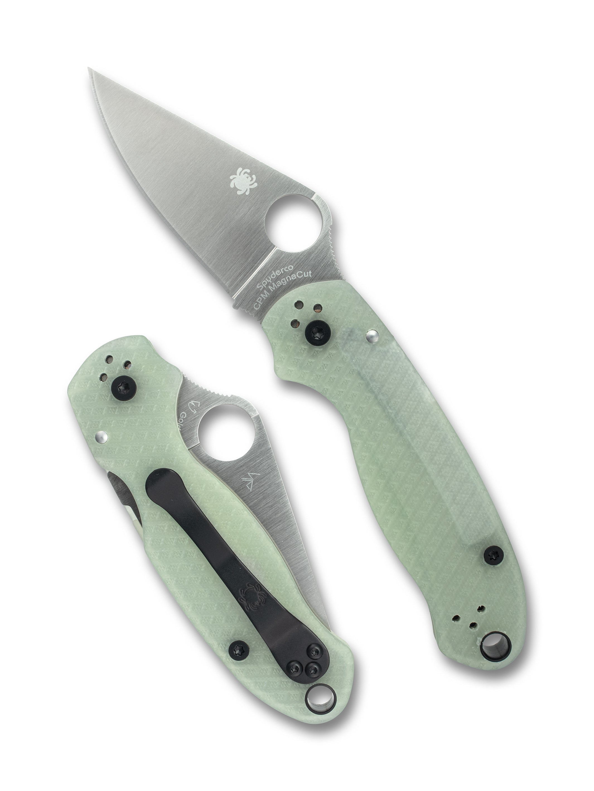</a> | C223GNDMCP | March 2026 | CPM MagnaCut | Natural diamond mesh G-10 | Blade HQ excl. |  |  |
| 47 |  | C223GNDMCBKP | March 2026 | Black DLC-coated CPM MagnaCut | Natural diamond mesh G-10 | Blade HQ excl. |  | C223GNDMCPBK (wiki) |

## Para 3 Lightweight (25)

| # | Image | Model No. | Released | Steel | Handle | Type | Qty | Alt SKU |
|---|---|---|---|---|---|---|---|---|
| 1 |  | C223PBK | Apr. 2019- | CTS-BD1N | Black FRN | Regular production |  |  |
| 2 |  | C223SBK | Apr. 2019- | CTS-BD1N | Black FRN | Regular production |  |  |
| 3 |  | C223PRD | Oct. 29, 2019 @ 11AM CST | Satin M390 | Red FRN | DLT Trading excl. |  |  |
| 4 | <a href="images/C223PBBK.jpg">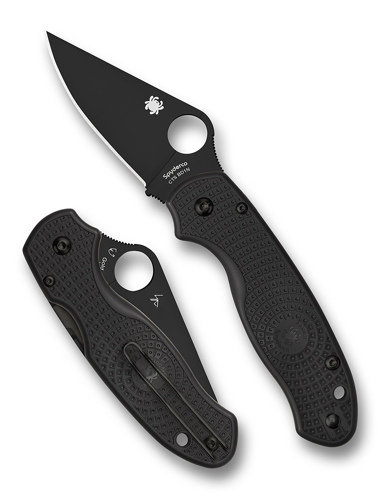</a> | C223PBBK | Dec. 2019- | Black DLC coated CTS-BD1N | Black FRN | Regular production |  |  |
| 5 |  | C223PCBL | 2020 - | CPM SPY27 | Cobalt blue FRN | Regular production |  |  |
| 6 | <a href="images/C223SBBK.jpg">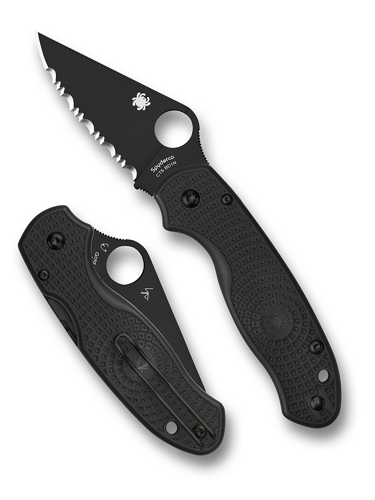</a> | C223SBBK | Feb. 2020- | Black DLC coated CTS-BD1N | Black FRN | Regular production |  |  |
| 7 |  | C223PBORE | Mar. 2020 | CPM REX 45 | Burnt-orange FRN | Sprint Run | 1200 |  |
| 8 |  | C223PTBL | 2021 | CPM-S90V | Teal FRN | MGE Wholesale excl. |  |  |
| 9 |  | C223PNBL | Mar. 2021 | CPM-20CV | Stone Blue FRN | KnifeJoy excl. |  |  |
| 10 |  | C223GRM4 | June 2021 | CPM-M4 | Mint green FRN | Blade HQ excl. |  | C223GPGRM4 |
| 11 |  | C223PWH | Sep. 2021 | CPM REX 45 | White FRN | GP Knives excl. |  |  |
| 12 |  | C223PWHBK | Nov. 2021 | Black DLC coated CPM REX 45 | White FRN | GP Knives excl. |  |  |
| 13 |  | C223PRDBK | Feb. 2022 | Black DLC coated CPM-4V | Red FRN | St. Nick's excl. | ~1600 |  |
| 14 |  | C223POR | March 2022 | CTS-XHP | Orange FRN | Cutlery Shoppe excl. | ~1000 |  |
| 15 |  | C223PORBK | Jul. 2022 | Black DLC coated CTS-XHP | Orange FRN | Cutlery Shoppe excl. |  |  |
| 16 | <a href="images/C223PPN.jpg">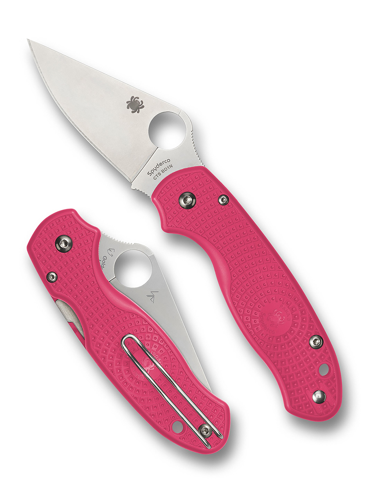</a> | C223PPN | 2023 - | CTS-BD1N | Pink FRN | Regular production |  | C223PN (wiki) |
| 17 | <a href="images/C223PPNBK.jpg">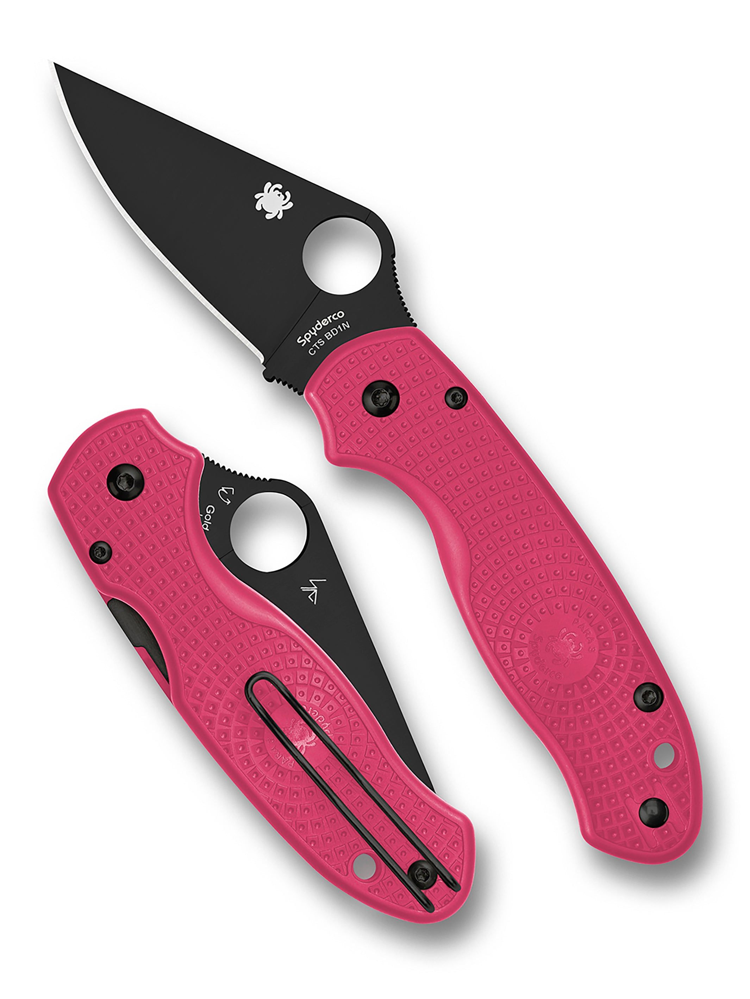</a> | C223PPNBK | 2023 - | Black DLC-coated CTS-BD1N | Pink FRN | Regular production |  | C223PN (wiki) |
| 18 |  | C223PYL | 2023 - | CPM MagnaCut | Yellow FRN | Regular production |  | C223YL (wiki) |
| 19 |  | C223KBPI | Sep. 2023 | CTS-BD1N | Black FRN | Limited |  |  |
| 20 |  | C223PFGRCWBK | Dec. 2023 | Black DLC coated Cru-Wear | Deep Forest Green FRN | The Knife Joker excl. |  | C223PFGRCWBKCRF (spyderco.com, 2026 listing) |
| 21 |  | C223PODFDE | July 2024 | Flat dark earth PVD-coated CTS-204P | Olive Drab FRN | River's Edge Cutlery excl. |  |  |
| 22 |  | C223SYL | 2025 - | CPM MagnaCut | Yellow FRN | Regular production |  |  |
| 23 |  | C223PBN15V | Jan. 2025 | CPM 15V | Brown FRN | Sprint Run |  | C223BN15V (wiki) |
| 24 |  | C223PFG | Feb. 2025 | CTS-204P | Forest Green FRN | KnifeWorks excl. |  |  |
| 25 |  | C223PGRM4BK | Apr. 2025 | Black DLC coated CPM-M4 | Mint Green FRN | BladeHQ excl. |  |  |
